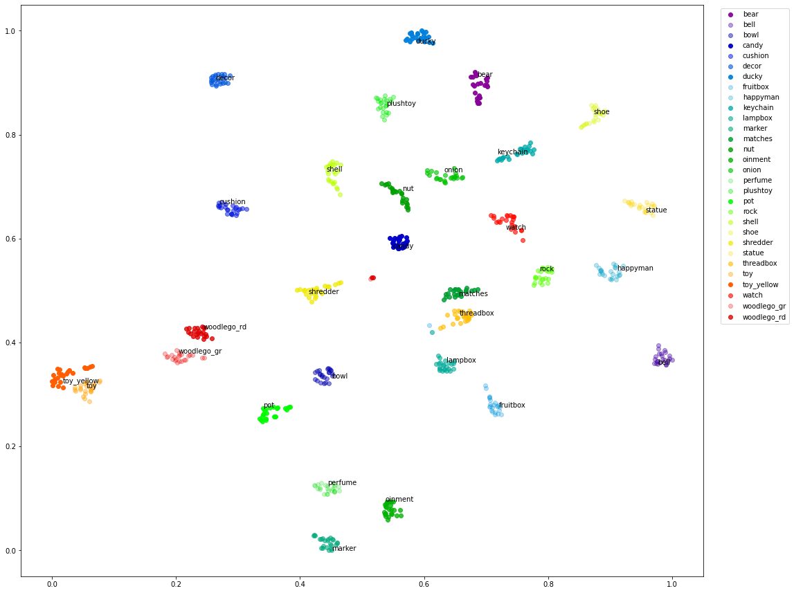

## cluster-embeddings

* This repo does unsupervised labeling based on the image content using a resnet backbone
* The unsupervised labeling is for solving classification labeling problem.
* The inputs are the path to the image directory and the number of classes (rough guess) which are given by the user
* The classes are labeled numerically as "class1", "class2" etc
* To improve intergration between differnt labeling softwares and DL frameworks the labeling info is stored as csv 
* The csv can be read by the ML/DL framework and images can be tagged automatically by an automation script
* Here i have provided a sample script for importing and exporting in CDL framework
* This is useful where the image content varies across the total image but if we are looking at few pixels then the system needs
  some information on the type of feature we are looking at. This functionality will be covered in another repo
  
  ---
  
  *Sample clustering of features generated by a resnet50 backbone*
  
  
  
